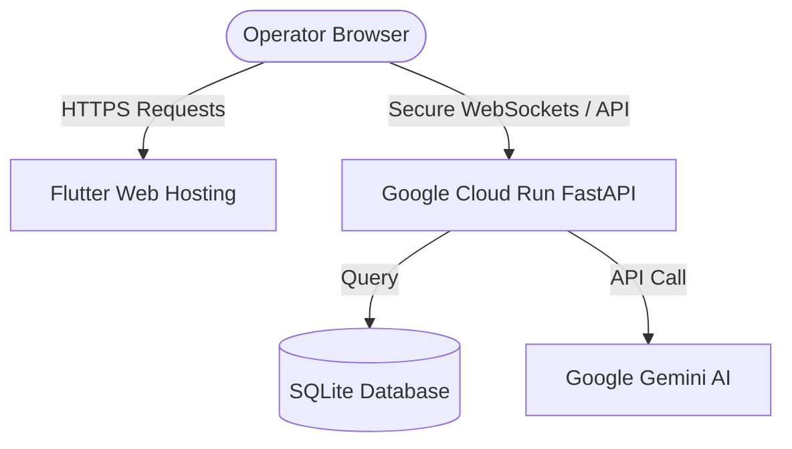

# Aurora V3 "Titan" — Cloud Deployment Guide 🌐

This guide provides a step-by-step manual for deploying the **Aurora** FastAPI backend to **Google Cloud Run** and the **Flutter Web frontend** to a free hosting provider (like **Vercel** or **Netlify**) to obtain live, public `https://` URLs for both.

---

## 🏗️ Architecture Overview

To run Aurora globally:


*   **FastAPI Backend:** Deployed as a serverless container on **Google Cloud Run**. (Completely free tier, scale-to-zero, secure HTTPS URL).
*   **Flutter Frontend:** Compiled to Web assets (`flutter build web`) and hosted on **Vercel** or **Netlify**. (Ultra-fast CDN, automated deployments, zero configuration).

---

## 1. 🐍 Deploying the FastAPI Backend to Google Cloud Run

Google Cloud Run allows you to deploy containerized APIs directly from a GitHub repository using a visual web interface (no CLI tools needed).

### Option A: Deploying via Google Cloud Web Console (easiest & no CLI)

#### Step 1: Push your Backend to GitHub
1. Create a **GitHub** repository (e.g., `aurora-backend`).
2. Initialize Git inside `C:\Users\Nouman\Desktop\New folder (2)\aurora_backend` and push it:
   ```bash
   git init
   git add .
   git commit -m "Initialize Aurora backend"
   git remote add origin <your-github-repo-url>
   git branch -M main
   git push -u origin main
   ```

#### Step 2: Set up Google Cloud Run
1. Go to the [Google Cloud Console](https://console.cloud.google.com/).
2. Create a new Google Cloud Project (or select an existing one).
3. Search for **Cloud Run** in the search bar and click on it.
4. Click **Create Service**.
5. Select **"Continuously deploy from a git repository"** and click **Set up with Cloud Build**.
6. Select **GitHub** as your provider, authenticate, and choose your `aurora-backend` repository.
7. Click **Next** and configure:
   *   **Branch:** `^main$`
   *   **Build Type:** Select **Dockerfile**. (It will automatically detect the `Dockerfile` we have in the folder!).
8. Click **Save**.

#### Step 3: Configure Service Settings
1. **Service Name:** `aurora-backend`
2. **Region:** Choose a region close to you (e.g., `us-central1` or `asia-east1`).
3. **Authentication:** Select **"Allow unauthenticated invocations"** (this makes your API public so your frontend can connect).
4. Expand **"Container, Connections, Security"** to set environment variables:
   *   Under **Variables**, add:
       *   `GEMINI_API_KEY` = `your-actual-gemini-api-key` (If you want live AI).
5. Click **Create**.

> [!TIP]
> Google Cloud will build your Docker container, deploy it, and provide a secure public URL (e.g., `https://aurora-backend-abcde-uc.a.run.app`). Keep this URL handy, as your frontend will need it!

---

## 2. 🚀 Building & Deploying the Flutter Frontend

Since your frontend is built with Flutter, compiling it to web and uploading it to a static host is the fastest and most cost-effective path.

### Step 1: Build the Flutter Web Assets
Open a terminal in your frontend directory (`C:\Users\Nouman\Desktop\New folder (2)\aurora`) and run:
```powershell
flutter build web --release
```
This will compile your Flutter app into static HTML, JS, and CSS files, saved under:
📁 `C:\Users\Nouman\Desktop\New folder (2)\aurora\build\web`

### Step 2: Update the API Endpoint
Before uploading, make sure your Flutter app points to your **new Cloud Run Backend URL** instead of `http://127.0.0.1:8000`.

1. Open [auth_provider.dart](file:///C:/Users/Nouman/Desktop/New%20folder%20(2)/aurora/lib/providers/auth_provider.dart) and replace `127.0.0.1:8000` with your new backend hostname.
2. Re-run `flutter build web --release`.

### Step 3: Deploy to Vercel (Instant 10-Second Drag-and-Drop)

Vercel is the easiest place to host Flutter Web.
1. Sign up/Log in to [Vercel](https://vercel.com/).
2. Go to the [Vercel Dashboard](https://vercel.com/dashboard) and click **Add New** > **Project**.
3. Under **"Clone Template"** or **"Other"**, click **"Browse All Templates"** or simply go to [Vercel Deploy](https://vercel.com/deploy).
4. Alternatively, download the **Vercel CLI** or drag-and-drop:
   * Go to [vercel.com/new](https://vercel.com/new).
   * Drag the `build/web` folder directly into the web uploader.
5. Vercel will instantly host it and give you a working public address (e.g., `https://aurora-web.vercel.app`)!

---

## 🛠️ Production Environment Tuning

> [!IMPORTANT]
> If you deploy to Google Cloud Run, SQLite database records (like registered users) are saved inside the container file system. Because Cloud Run is serverless, the container restarts occasionally, which will reset the database.
>
> **For Hackathon Demos:** This is perfectly fine and works flawlessly.
> **For Production:** Connect Cloud Run to a managed database like **Google Cloud SQL (PostgreSQL)** or mount a **Cloud Storage / Filestore** volume to persist `aurora.db`.
